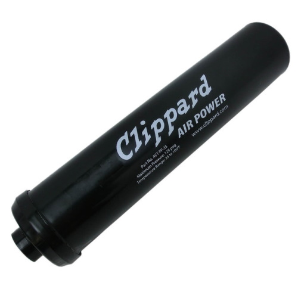

# Air Tank

[Manual](https://drive.google.com/open?id=1WLUcM-aUneVJ4s_wHbJVvv1qbQ2T8EVP) (Clippard Air Tank)

The air tanks we normally use are polypropylene, with a max PSI of 125.

> A Clippard Air Tank