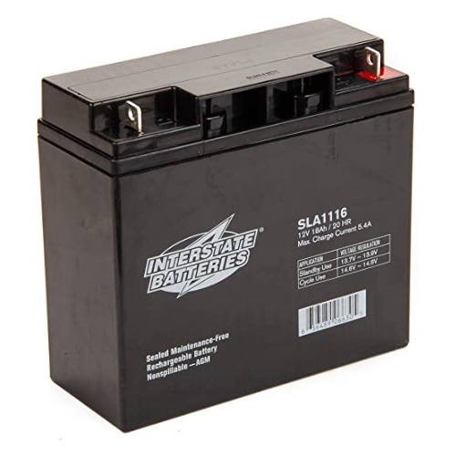

# Battery

For FIRST competitions, teams use 12V lead-acid batteries, typically with a capacity of 18AH. They must be handled with care, because if they are damaged they may start to leak.

> A typical battery used in a FIRST competition