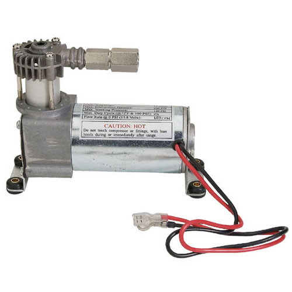

# Compressor

[Manual](https://drive.google.com/open?id=1_CKBhHQiGvcO9tprXSwP9kb_aAwvM-QB) (Viair 90C)

The compressor is used to pressurize air into the air tanks. It needs a 12V input from the PCM and is automatically shut off by the PCM if the pressure switch is activated.

> A Viair 90C Compressor