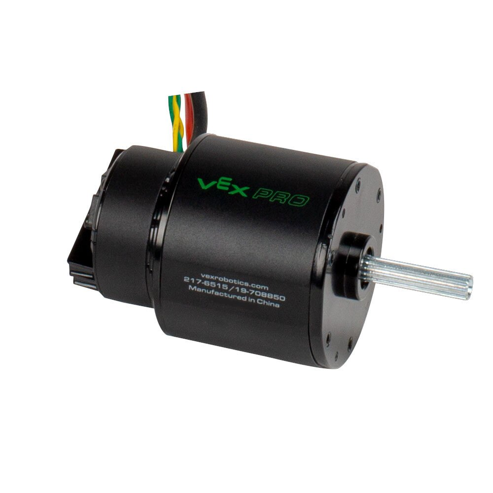

# Falcon 500

[Manual](https://drive.google.com/open?id=1TvSmo6Wplj4bCiaB4cUweQeUUUQGGidg)

A Falcon 500 is a motor with a Talon SRX and encoder built in. It's a high power, efficient, and small footprint motor, and can be used for moving the robot, climbing, and other power hungry tasks. It also has more power than a CIM motor while being smaller. It has input power wires (red and black) as well as CAN bus wires. It has a 4 pin port (It is NOT the same data port found on a Talon) that can be used for attaching senors to control the motor, such as a limit switch. This motor also cannot just be directly plugged into a PWM box as it requires a CAN bus to be controlled.

> A Falcon 500