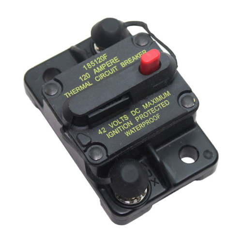

# Main Breaker

[Manual](https://drive.google.com/open?id=1nRZBlc9fKDBKhuUBNdYTQ0Y7a6jBwhpj)

The main breaker is a switch with a 120 amp fuse that can turn on and off the robot. To turn it on, push the lever towards the center of the breaker. To turn it off, press the red button.

> The Main Breaker