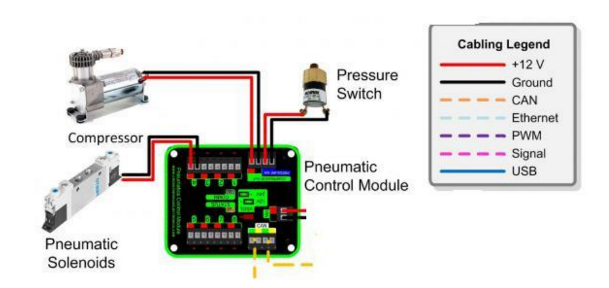

# PCM

[Manual](https://drive.google.com/open?id=1kWoA-SCn6Qr3MnNQ7-0HTFHMUuyn-z3o)

The PCM, or **P**neumatics **C**ontrol **M**odule, is used for controlling solenoids through the CAN bus. It can control up to 8 solenoids. It has power input from the PDP, and has a port for connecting to the pressure switch. It also has power output to the compressor. There is a jumper in the middle of the PCM that can be switched to send the solenoids a 12V or 24V signal.

> A PCM wired to a compressor, solenoid and pressure switch