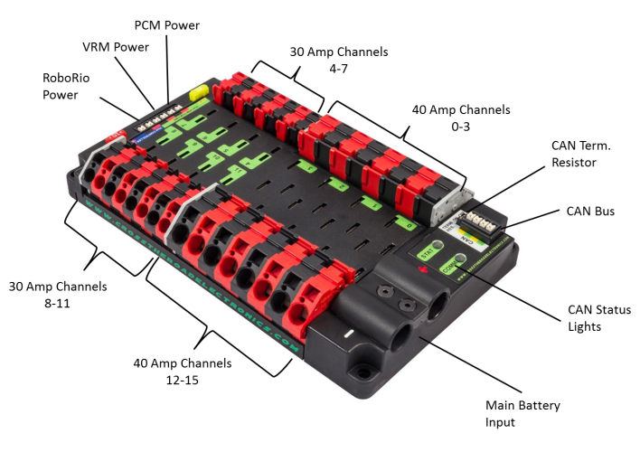

# PDP

[Manual](https://drive.google.com/open?id=1cjab8W6veHw84hOV6p_WHRP8421DpSs8)

The PDP, or **P**ower **D**istribution **P**anel, is used to take power from the battery and split it off to every component. There are a total of 16 pairs of positive and ground connections. 8 Of these connections are larger connections used for Talons, Victors, or Falcon 500s that would move the robot, be used in a climber, etc. These connections each have their own individual 40 amp fuses. The 8 smaller connections are used for Talons or Victors attached to less power hungry motors, such as the pivoting/turning motors on swerve drive, an intake, an elevator, or a conveyor. The bottom of the PDP has specialized power ports for the RoboRIO, VRM, and PCM. The PDP is also controlled by the CAN bus, and has a built in CAN bus terminator, if the CAN bus were to end at the PDP. There is a jumper next to the CAN bus ports that can be moved to turn the CAN bus terminator on and off.

> A PDP with all ports labeled