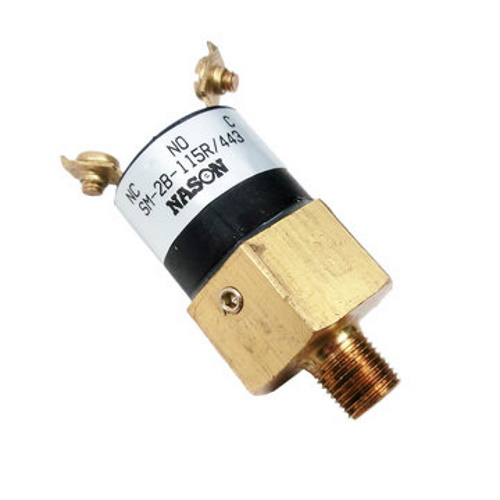

# Pressure Switch

[Manual](https://drive.google.com/open?id=1Phi53csbWZu3JkBB2yM4FXYovUzFsP5r) (Nason Pressure Switch)

A pressure switch is used to detect when the robot is at a specific PSI, in our case 120PSI. When it hits the said threshold, it sends a signal to the PCM so that the compressor is shut off.

> A Nason Pressure Switch