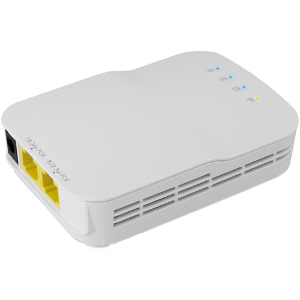

# Radio

[Manual](https://drive.google.com/open?id=17UcJbvVKhnO-QubtLTGZTNUySGsWdZ4Z)
 
The Radio is essentially a WiFi router that allows the robot to be wirelessly controlled. It connects through ethernet to the RoboRIO. At competition, it is flashed with specific firmware to be controlled by the driver station through the game field, so that when the match stops the robot can no longer be controlled by the driver station. However, in normal use at workshops driver stations can connect to the radio via WiFi and control the robot. It has two ethernet ports and a barrel jack for power. However, you don't need to use the barrel jack for power if you're using PoE (Power Over Ethernet). If a Raspberry Pi is being used for vision, it will also be plugged into the radio via ethernet.

> The Radio