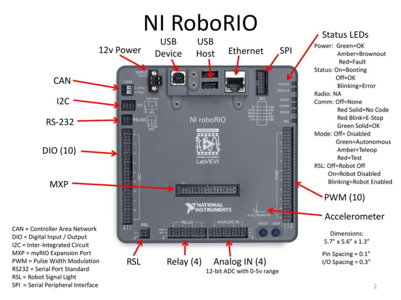

# RoboRIO

[Manual](https://drive.google.com/open?id=19VnzXJlRNtUoSzRmrhAjg9dSFle23Aj7)
 
The RoboRIO is a programmable robotics controller that allows FIRST teams to control the robot via a CAN bus as well as communicate with other components on the robot through other connections on the RoboRIO, listed below:
 
- I2C, or Inner-Integrated Circuit
- DIO, or Digital Input Output
- Relay
- Analog Input
- PWM, or Pulse width modulation
- SPI, or Serial Peripheral Interface
- USB (Type B)
- USB Host Ports (Type A)

The RoboRIO also has an RSL port, standing for Robot Signal Light. This port allows you to attatch the orange signal light to the RoboRIO.
The center of the RoboRIO has an MXP port, or "myRIO Expansion Port". We normally use this port for connecting a board that allows software to find the robot's rotation for Swerve Drive.
To control the RoboRIO, the RoboRIO is connected through ethernet to the radio.

> A RoboRIO with all ports labeled
