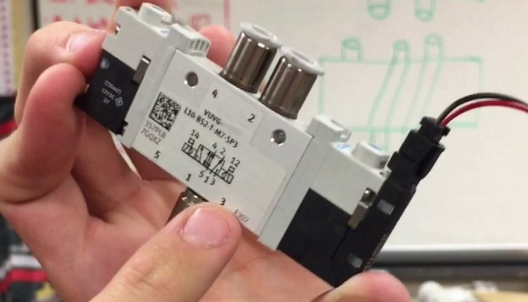

# Solenoid

[Manual](https://drive.google.com/open?id=1QfN1CEqKSeizNRX45-G0WHmVtpDgSTHv) (Festo VUVG-L10-B52-T-M7-1P3)

A solenoid opens and closes pneumatic valves to control airflow. In our case, we use solenoids with one input that should be connected to pressure and two outputs, one output going to the top of a piston and the other output going to the bottom of a piston. When a valve is opened, the pressure from the input is allowed to flow through that valve and into the respective end of the piston. Solenoids are controlled by the PCM on the robot. Make sure to check if the solenoid you are using is 12V or 24V, as they can come in either voltage.

> A Festo VUVG-L10-B52-T-M7-1P3 solenoid with one input and two outputs