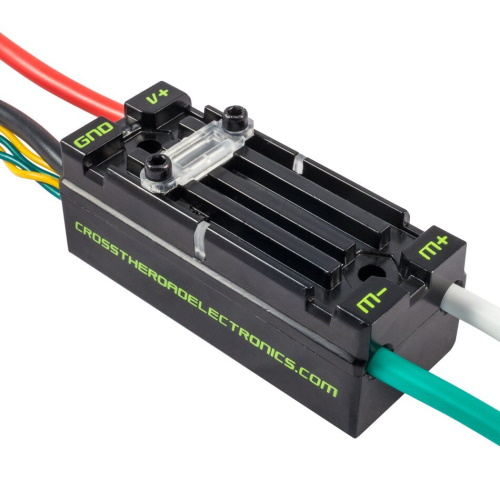

# Talon SRX

[Manual](https://drive.google.com/open?id=1-YfiWAvTHcmaWdiqsFG4qo_DffEqFvYq)

A Talon is used to control a motor via the CAN bus. The power input wires are red and black, while power output wires to go to the motor are green and white. A Talon also has a data port, which can be used for attaching breakout boards, encoders, limit switches, etc. The only motor that does not require a separate talon to be controlled by the CAN bus is a Falcon 500, due to it having a Talon built in.

> A Talon SRX