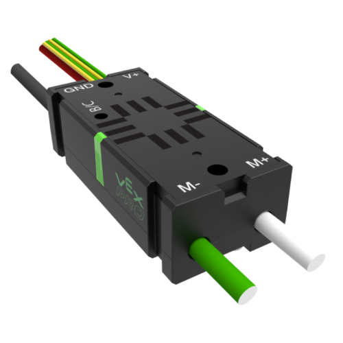

# Victor SPX

[Manual](https://drive.google.com/open?id=1W_xRlIqPRln9JOhYm5w4T9oo09dra0rj)

A Victor SPX is very similar to a Talon, just without some of the features a Talon provides. It does not have a data port, and it does not have current limiting and measurement. It is controlled by the CAN bus, has red and black input power wires, and green and white power output wires.

> A Victor SPX