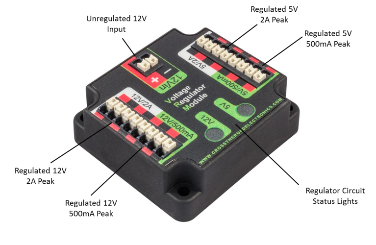

# VRM

[Manual](https://drive.google.com/open?id=1ODWJeCeQBR0xHpQte9cmaYQ51K-7MsYj)

The VRM, or **V**oltage **R**egulator **M**odule is used for connecting components that need a 5V or 12V voltage. For each of the two voltages, there are four total circuits, two being regulated to peak at 500mA while the other two are regulated to peak at 2A. It gets 12V from the PDP. Just be aware that the 12V 2A connectors are only allowed to be used to power the radio, as per FIRST's regulations. The VRM does also not require a CAN bus connection.

> A VRM, with all ports labeled