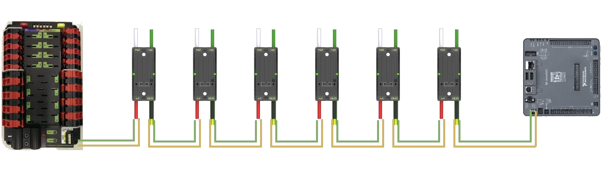

# Controlling the robot

> Yeah it looks cool, but how does it know what to do?

### CAN Bus

The robot is controlled through what is called a CAN bus: **C**ontroller **A**rea **N**etwork. The CAN bus is two wires, in our case green and yellow, that starts at the main "computer", the RoboRIO. Software puts code on the RoboRIO that then sends information through the CAN bus to individual electronic components. The CAN bus goes thorough almost everything on the robot: Talons, Victors, Falcon 500s, the PCM, and the PDP. After it has gone through all of these components, it is terminated with a resistor (The PDP also has a terminator built in, and can be switched on and off.) Not all components require the CAN bus, such as the VRM. Also, solenoids are not each individually given a CAN bus as well as the pressure switch as they are controlled by the PCM, which needs the CAN bus.

> A typical CAN bus configuration. The CAN bus starts at the RoboRIO (Right), goes through all of the Talons, then is terminated at the PDP (Left).

***

### Other Connections

Some components still communicate with the RoboRIO without the CAN bus. There are DIO, PWM control, and other headers on the RoboRIO that allows components such as optical sensors to communicate with the RoboRIO.

Lastly, some components communicate directly with Talons, such as encoders and limit switches. Normally, they connect to Talons using a Breakout Board.