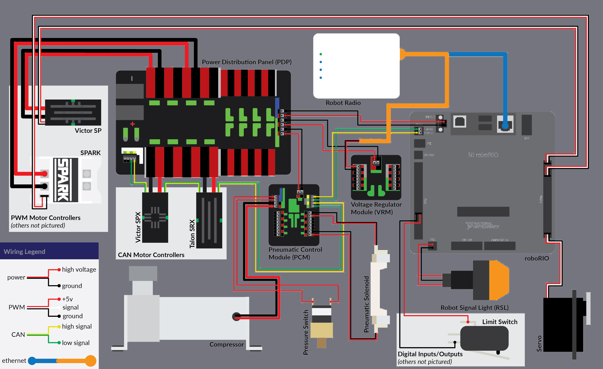

# How the robot works

FIRST has created a system in which teams can wire their electronics to make an effective robot. While it has changed over the many years FIRST has been around, the general idea has remained the same. In this section, you will find how the robot is controlled as well as powered.

