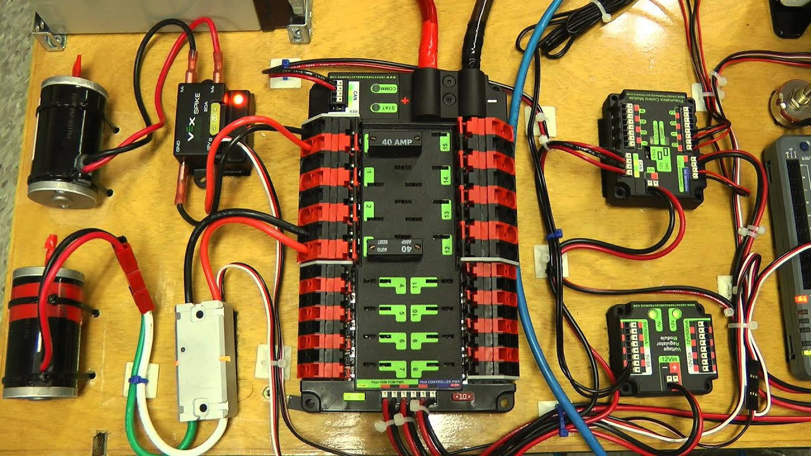

# Powering the robot

> Ya can't move without power!

The robot operates off of a battery. From the battery, there is a main power cable, normally 6 gauge, that connects the battery to the PDP. In between the PDP and the battery, there is a main breaker on the positive line that can turn on or off the robot. From the PDP, power is distributed to Talons, Victors, Falcon 500s, etc. Every terminal has its own fuse; The 8 Larger terminals have 40 amp fuses, and the smaller 8 terminals can have a 20 or 30 amp fuse. There are also extra ports on the bottom of the PDP that are used to plug in the VRM, PCM and RoboRIO. If pneumatics are being used, the compressor is plugged into the PCM.

***

> An Example of multiple devices connected to a PDP